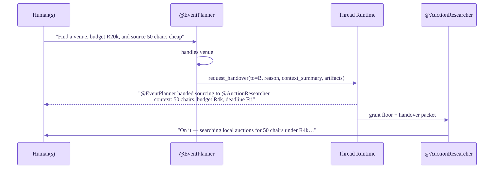
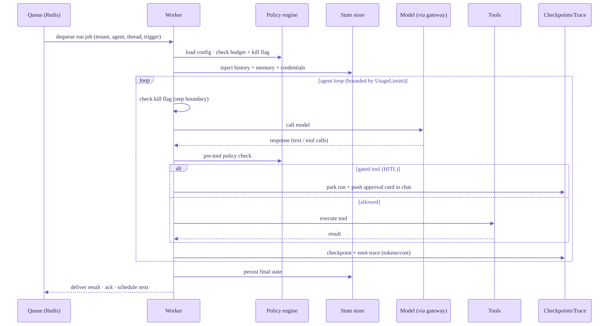
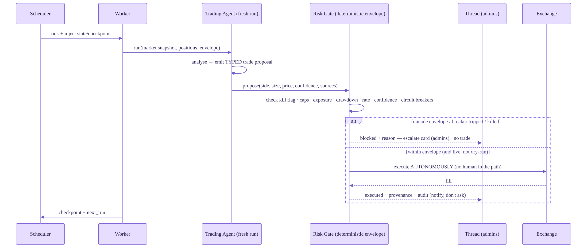
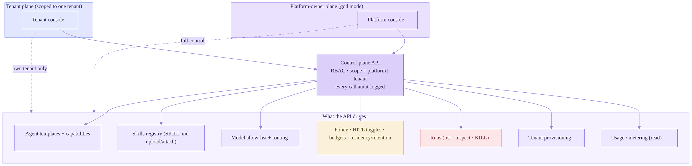
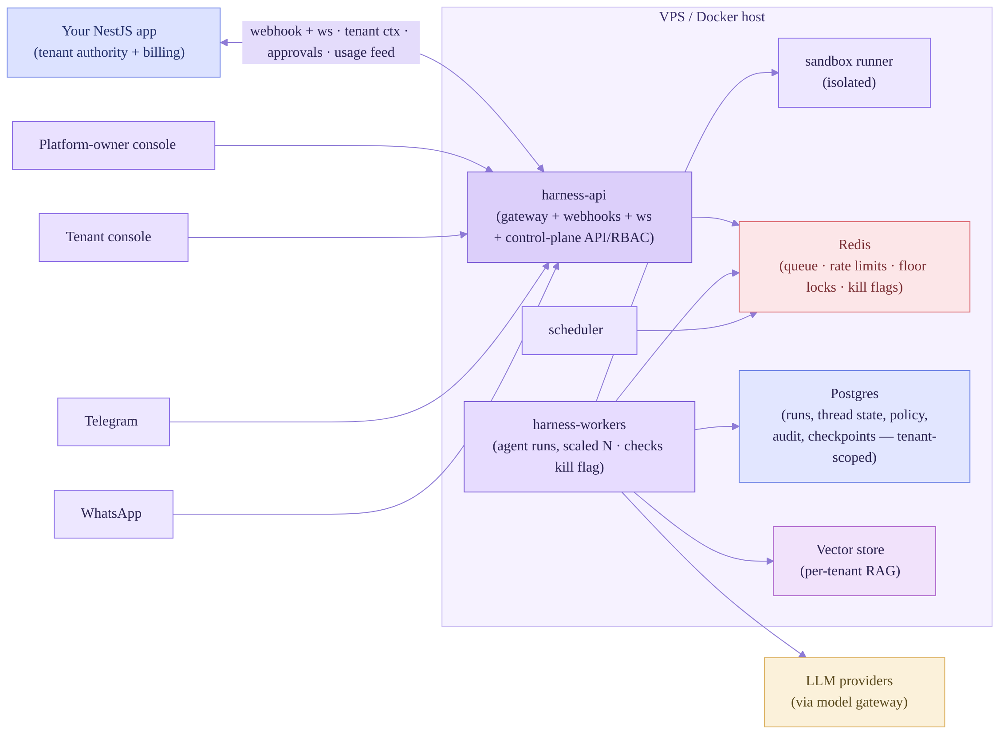

# Agent Harness — System Design

**Status:** Draft v0.4 · Design only (no implementation)
**Author context:** Agent layer for an **existing** multi-tenant, white-label chat platform (React Native + NestJS). The chat app already owns tenancy, white-label, users and threads; the harness consumes that context rather than rebuilding it.
**Core engine:** Pydantic AI V2 (harness-first, capabilities as the core primitive).
**Deployment target:** Docker container(s) on a VPS, horizontally scalable.

**What changed in v0.2:** Multi-tenancy is now treated as *upstream-provided* (your chat app is the tenant authority — the harness no longer builds a tenant registry, only enforces tenant-scoped policy). HITL approval is now a **toggleable** gate with an explicit resolution order. The following are promoted from "ideas" to confirmed, first-class features: agent template gallery, approval inbox, cost budgets with hard caps, provenance badges, quiet hours / delivery windows, multi-language threads, per-tenant guardrail policies, and data residency / retention controls.

**What changed in v0.3:** The control plane is now **two planes over one Control-plane API** (§4.9): a *platform-owner plane* with full god-mode control (create agent templates, add skills, manage models, provision tenants, global kill switch, cross-tenant monitoring) and a *tenant plane* scoped to a single tenant's own agents, skills, policy, usage and runs. Approvals **move out of the dashboard and into the chat platform** — a HITL gate now pushes an interactive approval card into the thread/chat app; dashboards only show pending counts for monitoring. Added a **kill switch** (§4.10) with four tiers (run / agent / tenant / global) as a first-class safety control.

**What changed in v0.4:** All open decisions resolved (§15). Added **in-chat surfaces** (§4.11) — the chat app, not the dashboard, is the end-user surface, including a new **interactive dashboard pop-up** message type (an agent sends a link/card; the chat app opens a webview rendering live interactive HTML). Boundary contract decided: the **harness filters** to messages that mention an agent *and* match trigger phrases *and* where the agent belongs to that group. Trading may run **autonomously inside a deterministic safety envelope** (per-trade HITL is too slow) — §6 rewritten around bounded autonomy + circuit breakers + kill switch rather than approve-every-trade. Approvals route to the whole thread but only **group admins** can approve (button-gating in the chat app, re-verified server-side). Added **§16 Operator & developer surfaces** (ops console + Logfire split) and a **worker run lifecycle** diagram.

---

## 1. What we are building

A single, modular **agent harness** — a long-lived Python service that hosts many agents, connects to multiple messaging channels, and lets agents and humans collaborate inside the *same* conversation threads. It must:

- Serve all your existing tenants from one deployment, **respecting** the tenant/white-label boundary your chat app already defines (the harness scopes everything to the `tenant_id` it's handed; it does not manage tenants).
- Put agents and people in the same group threads, with **transparent handover** between agents.
- Support direct 1:1 human↔agent chat.
- Run some agents continuously for months without losing state.
- Be accurate enough to back high-stakes agents (e.g. trading), where a wrong action has real cost.
- Stay **shallow**: few layers, flat composition, declarative config over deep class hierarchies.

The harness is a *separate service* from your NestJS app. They talk over a thin, well-defined boundary (webhook + websocket/event bus), so neither owns the other. Your app stays the system of record for users, threads, and messages; the harness owns agents, runs, and tool execution.

---

## 2. Design principles (the spine of every decision below)

1. **Shallow by default.** The default execution shape is *one agent, one flat tool list, one loop*. Multi-agent orchestration is an opt-in escalation, capped at **two tiers** (a thread-level router + the agent doing the work). No deep supervisor trees unless a task genuinely cannot be done flat.
2. **Capabilities, not inheritance.** An agent = a base model + a set of *capabilities*. A capability bundles tools, hooks, instructions, and model settings into one reusable unit (this is the native Pydantic AI V2 primitive). White-label customisation = swapping capabilities, not subclassing.
3. **Declarative agents.** Every agent is defined in versioned YAML/JSON config (Pydantic AI V2 supports code-free agent definitions). Tenants get agents by selecting and parameterising templates — no redeploy.
4. **Typed everything.** Inputs, tool args, and outputs are Pydantic models, validated with automatic retry-on-failure. This is the cheapest accuracy win available and it is free with the framework.
5. **The model never acts directly on the world.** For any side-effecting or high-stakes action (sending money, sending email, posting publicly), the LLM emits a *typed proposal*; deterministic code validates and executes it. Separation of *decide* from *do*.
6. **Everything observable.** Every run, tool call, token, and cost is traced (OpenTelemetry/Logfire). If you can't see it, you can't trust it — and you can't bill it.
7. **Stateless agents, stateful platform.** Agents hold no hidden memory between runs. All state (history, memory, checkpoints) lives in the platform and is injected per run. This is what makes 24/7 agents survivable and horizontally scalable.

---

## 3. High-level architecture

```mermaid
%%{init: {'theme':'base','themeVariables':{'fontFamily':'Segoe UI, system-ui, sans-serif','primaryColor':'#EDE7FF','primaryBorderColor':'#8B6FE8','primaryTextColor':'#2A2350','lineColor':'#8E7BD6','secondaryColor':'#E4DCFB','tertiaryColor':'#F5F1FF','clusterBkg':'#F6F2FF','clusterBorder':'#C9BCF2','titleColor':'#3A2F6B','actorBkg':'#E7DEFF','actorBorder':'#7C5CD6','actorTextColor':'#2A2350','actorLineColor':'#B6A6EC','signalColor':'#6E5AC2','signalTextColor':'#3A3160','labelBoxBkgColor':'#EDE7FF','labelBoxBorderColor':'#8B6FE8','labelTextColor':'#2A2350','loopTextColor':'#5A4BA0','noteBkgColor':'#FBF1DA','noteBorderColor':'#E3C98B','noteTextColor':'#4A3F2A','activationBkgColor':'#D9CCFA','activationBorderColor':'#9A82E0'},'flowchart':{'useMaxWidth':false,'htmlLabels':true,'curve':'basis'},'sequence':{'useMaxWidth':false}}}%%
flowchart TB
    subgraph App["YOUR CHAT APP — tenant authority (already built)"]
        NEST["NestJS · owns tenants, white-label, users, threads, billing"]
    end

    subgraph Channels["Channel Layer (adapters)"]
        CA["Custom App adapter"]
        TG["Telegram adapter"]
        WA["WhatsApp adapter"]
        GM["Gmail / email adapter"]
        SL["Slack adapter"]
    end

    GW["Gateway / Normaliser<br/>InboundMessage (carries tenant_id + locale)<br/>dedupe · edge rate-limit · injection screen"]

    subgraph Thread["Thread Runtime"]
        FC["Floor control (who speaks)"]
        RT["Router / dispatcher"]
        HO["Handover protocol (transparent)"]
        ML["Language detect + reply locale"]
    end

    subgraph Harness["Agent Harness (Pydantic AI V2)"]
        AR["Agent registry (declarative configs)"]
        CAP["Capabilities (tools+hooks+instr+model)"]
        MR["Model router (switch / fallback)"]
        SK["Skills loader (SKILL.md)"]
        UL["Usage limits (loops · tokens · tool calls)"]
        HITL["HITL gates — TOGGLEABLE"]
        PROV["Provenance / citations"]
    end

    subgraph Exec["Execution & Long-Running Runtime"]
        Q["Task queue / workers"]
        DUR["Durable runs + checkpoints"]
        SCH["Scheduler / cron (anti-recursion + quiet hours)"]
        SBX["Sandbox (isolated code exec)"]
    end

    subgraph Tools["Tools & Integrations"]
        MCP["MCP connectors (Gmail · WhatsApp · web · browser)"]
        VAULT["Per-tenant credential vault"]
    end

    subgraph State["State & Memory (tenant-scoped)"]
        HIST["Thread history"]
        MEM["Procedural memory / learned skills"]
        RAG["Knowledge (vector)"]
        CKPT["Checkpoint store"]
    end

    subgraph Gov["Governance, Evals & Observability"]
        POL["Per-tenant policy engine<br/>guardrails · HITL toggle · budgets & hard caps"]
        RES["Residency + retention controls"]
        OTEL["Tracing / Logfire"]
        EVAL["Evals (accuracy regression)"]
        METER["Usage metering"]
        AUDIT["Audit log (high-stakes actions)"]
    end

    subgraph CP["Control Plane (§4.9)"]
        API["Control-plane API (RBAC)"]
        ADM["Platform-owner console"]
        TEN["Tenant console"]
        KILL["Kill switch (run/agent/tenant/global)"]
    end

    NEST -->|tenant ctx + white-label config| CA
    Channels --> GW --> Thread --> Harness
    POL -. enforces .-> Harness
    POL -. enforces .-> Tools
    Harness <--> Tools
    Harness <--> State
    Harness --> Exec
    Exec --> Harness
    HITL -->|approval card| NEST
    NEST -->|approve / deny| GW
    Harness --> Gov
    Thread --> Gov
    State --> RES
    Tools --> VAULT
    METER -->|usage feed| NEST
    ADM --> API
    TEN --> API
    API -->|create agents · add skills · set policy| Harness
    API --> POL
    API --> KILL
    KILL -. halts .-> Exec
style App fill:#E2E6FF,stroke:#6F84E6
style Channels fill:#EFE9FF,stroke:#9B86EC
style Thread fill:#EAE1FF,stroke:#8E6FE6
style Harness fill:#E7DCFF,stroke:#7C5CD6
style Exec fill:#E3E8FF,stroke:#6F84E6
style Tools fill:#F1E2FB,stroke:#B36FD0
style State fill:#FBE7F6,stroke:#CE6FB6
style Gov fill:#FBF1DA,stroke:#DDB466
style CP fill:#ECE6FF,stroke:#8B6FE8
style NEST fill:#DCE2FF,stroke:#6F84E6,color:#23306B
style HITL fill:#FBF0DA,stroke:#DDB466,color:#5A4A1E
style KILL fill:#FCE6E8,stroke:#DC6E76,color:#7A2E33
style GW fill:#EDE7FF,stroke:#8B6FE8
```

**Read the diagram top-down as the request path** (your app hands the harness tenant context → a message is normalised → the thread runtime decides who responds and in which language → the harness runs the agent under tenant policy → tools/state/exec support the run → governance enforces and observes throughout). Most messages take the short path: Gateway → Thread Runtime → one agent → reply. The Execution layer only engages for long-running or scheduled work. **Two control flows to note:** (1) when a HITL gate fires, the approval request is pushed as an interactive card into your chat app, the human approves *in the thread*, and the run resumes — the dashboards never hold the action. (2) The control plane (platform + tenant consoles) drives everything through one RBAC'd Control-plane API, including the kill switch that can halt a run, an agent, a tenant, or the whole platform. **The boundary holds:** your chat app stays the tenant authority and system of record; the harness owns runs, tools, agent state, policy enforcement, and the control plane.

---

## 4. The layers, one by one

For each layer: what it does, and the **shallowness rule** that keeps it from sprawling.

### 4.1 Channel layer (adapters)

Each channel (your custom app, Telegram, WhatsApp, Gmail, Slack) gets one small adapter. An adapter does exactly two things: translate an inbound channel event into a canonical `InboundMessage`, and render a canonical `OutboundMessage` back to that channel. Nothing else. All business logic lives upstream so adding a channel is a contained, low-risk task.

Canonical envelope (the contract every adapter speaks):

- `InboundMessage`: tenant_id, channel, thread_id, message_id, sender (human|agent), text, attachments, mentions, reply_to, timestamp.
- `OutboundMessage`: tenant_id, channel, thread_id, blocks (text / cards / buttons), reply_to, sender_agent_id.

This adapter pattern is the single most important structural decision Hermes gets right — it is why one agent core can serve CLI, Telegram, Discord, Slack and WhatsApp without the core knowing which channel it's on. Copy it.

**Shallowness rule:** adapters contain zero agent logic. If you're tempted to put "decide what to do" in an adapter, it belongs in the thread runtime.

### 4.2 Gateway / normaliser

One front door. Authenticates the source, resolves the tenant, deduplicates retries (channels redeliver), rate-limits at the edge, and emits the canonical event onto the bus. This is also where you drop or quarantine anything that looks like prompt injection arriving through a channel (e.g. an email body telling the agent to "forward everything to X").

**Shallowness rule:** the gateway normalises and gates; it does not interpret intent.

### 4.3 Thread runtime (the distinctive part)

This is where your "people + multiple agents in one thread, with transparent handover" requirement lives. Four responsibilities:

**Floor control — who speaks.** *(Decided: floor state is owned by the harness, via Redis locks.)* In a group thread you cannot have every agent answer every message. A lightweight, mostly-deterministic policy decides which agent(s) are eligible to respond to a given message. Before any of that, an **invocation gate** in the harness decides whether the message is even *for* an agent — three conditions, all required:

1. **Mention** — the message `@mentions` an agent (or replies to one).
2. **Trigger phrase** — the message matches the tenant/agent's configured trigger phrases (so a passing "@SummariserBot lol" doesn't fire a run). Phrases are per-agent config; an empty list means "any mention fires".
3. **Group membership** — the mentioned agent is actually a member of *this* group/thread. **If someone @mentions an agent that doesn't belong to the calling group, it is ignored** — no run, no error chatter, optionally a quiet "that agent isn't in this group" hint. This stops cross-group invocation and accidental activation.

Only messages clearing all three reach the floor-control logic below. Everything else is dropped cheaply, before any model call — which is exactly the boundary-contract behaviour you wanted, done in the harness:

- Explicit `@mention` of a **member** agent → that agent has the floor.
- A reply to an agent's message → that agent keeps the floor.
- An active "owner" agent for the current sub-task holds the floor until it hands over or goes idle.
- Otherwise → either nobody (agents stay silent in human-to-human chatter) or a cheap **router** classifies whether any *member* agent should engage.

**Router / dispatcher.** A small, fast classification step (cheap model or rules) that maps an un-addressed message to the right *member* agent, or to "no agent". Keep this a *single* lightweight call — not a reasoning agent — to stay shallow and cheap, because it runs on every group message that clears the gate.

**Handover protocol — transparent to humans.** When agent A decides agent B should take over, it does *not* silently swap. It posts a visible thread event that both humans and agents can see, and writes a structured handover record:

The handover packet is a typed object: `{from, to, reason, context_summary, artifacts, constraints, return_to}`. `return_to` lets B hand the floor *back* to A when done, so a multi-agent task reads in the thread like a clean relay, not a free-for-all. Humans can always interrupt — a human message during an agent's turn is an interrupt signal (Hermes does exactly this: a new user message breaks the agent loop).

**Multi-language threads.** Each inbound message carries a `locale` (passed from your app, or detected per message). The thread runtime resolves a reply locale per recipient and the agent responds in that language; in a mixed-language group it can answer in the asker's language while keeping a canonical working language for internal reasoning and memory (so summaries and learned skills stay consistent). Useful across SADC where one thread may mix English, isiXhosa, Afrikaans, French (Mauritius). Keep it shallow: detect → set output language as a model instruction; don't fork agents per language. Tenant policy can pin a default language or restrict the allowed set.

**Shallowness rule:** floor control is rules-first. Reach for an LLM only for the ambiguous "should any agent care about this message?" call, and keep it to one cheap classification.

### 4.4 Agent harness (core, on Pydantic AI V2)

The heart. An agent is assembled from declarative config at run time:

- **Agent registry & template gallery** — versioned agent definitions (YAML/JSON). A tenant's "Chat Summariser" is `template:summariser` + tenant params. Versioned so you can roll back a prompt change and canary new ones. On top of the registry sits a **template gallery**: a curated catalogue of ready-made agents (summariser, event planner, auction researcher, …) that a tenant can pick and parameterise self-service — no redeploy. This is your white-label moat: tenants assemble their own agent line-up from approved building blocks, all governed by their policy (§4.8).
- **Capabilities** — the reusable bundles (tools + hooks + instructions + model settings). E.g. a `web-research` capability, an `email` capability, a `risk-gate` capability. Agents are composed from capabilities; this is how you keep behaviour reusable without inheritance.
- **Model router** — switch model per agent, per task, or as fallback, by changing a string (`anthropic:claude-opus-4-8` for hard reasoning, `anthropic:claude-sonnet-4-6` for the workhorse, `anthropic:claude-haiku-4-5` for cheap routing/summaries). The framework's gateway also does automatic failover across providers when one is rate-limited.
- **Skills loader** — Claude-style skills: a `SKILL.md` file plus optional scripts/resources in a folder, loaded **progressively** (the agent reads the short description first, pulls the full instructions only when relevant). This keeps context small and is how you give agents deep, domain-specific procedures (e.g. a "tender-evaluation" skill, an "auction-bidding-rules" skill) without bloating every prompt. Skills are per-tenant or shared from a gallery.
- **Tool registry** — flat catalogue of tools, each a typed function. Agents get a *subset* via their capabilities. Flat, not nested.
- **Usage limits** — per run: `request_limit` (caps LLM round-trips → stops infinite loops), `tool_calls_limit`, `response_tokens_limit`. These are your loop-control and runaway-cost guards, built in.
- **HITL approval gates — toggleable.** Any tool can require human approval before it runs, but *whether* a gate is active is a setting, not a hard-coded fact. Approval is resolved at run time from a clear precedence chain, **most restrictive wins**:

  1. **Global / safety floor** — actions that are *always* gated regardless of settings (e.g. live trade execution, sending money). These cannot be toggled off.
  2. **Per-tenant policy** — a tenant can require approval for whole categories (all outbound email, anything over R10k).
  3. **Per-agent config** — an agent template sets its own default (the trading agent ships gates-on).
  4. **Per-tool / per-argument rule** — conditional gates (approve only if `amount > threshold`, or recipient is external).
  5. **Per-thread / runtime override** — `/dryrun` or an admin toggle for this thread/session.

  When a gate fires, the run pauses (native deferred / human-in-the-loop tools) and the harness **pushes an interactive approval card into the chat platform** — into the thread where the work is happening, visible to everyone, with the proposed action, its provenance, and approve/deny controls. *(Decided:)* the card is shown to the **whole thread**, but **only group admins can approve** — the chat app enables the buttons for admins and disables them for everyone else. The chat app owns that button-gating UX; the harness still **re-verifies the approver's role server-side** when the approvals API is called, so a non-admin can't approve by replaying the request (never trust the client for a high-stakes gate). The human approves *in chat*, the chat app calls the approvals API, and the run resumes. Dashboards show a pending-approvals *count* only.

  *(Decided: policy lives in the harness and can be tenant- or user-dependent.)* The HITL toggle and its thresholds are resolved per tenant and, where configured, per user — e.g. a tenant requires approval for all outbound email, but a specific trusted user's drafts are auto-approved; or one tenant runs trading fully autonomous while another requires admin sign-off. A toggle never lets anyone switch off a level-1 floor gate — toggles only operate *above* the safety floor. Every toggle change and every approve/deny is audit-logged.

- **Provenance / citations.** Agents attach sources to factual claims and tool-derived data (a data snapshot, URL, or record id). The thread can render these as **provenance badges** (§10) so a human sees where a price, listing, or tender detail came from. For high-stakes agents, "no source" is a reason to abstain rather than assert.

**Shallowness rule:** one agent + flat tools + one loop is the default. Sub-agents are exposed as *tools* ("agent-as-tool") only when a task genuinely decomposes — never a standing hierarchy.

### 4.5 Execution & long-running runtime

This is what makes "runs for months" real.

- **Task queue + workers** (e.g. ARQ/Celery-style) — agent runs execute on workers, not in the web request. Lets you scale workers independently and survive restarts.
- **Durable runs + checkpoints** — Pydantic AI's durable execution preserves progress across API failures and restarts; pair it with a checkpoint store so a long-running agent resumes mid-task instead of starting over. (This is the DeerFlow lesson: long-duration work must be a *checkpointed stateful pipeline*, not an in-memory loop that a crash erases.)
- **Scheduler / cron** — for the 24/7 agents (a trading agent waking every minute, a tender scanner running daily). Each scheduled tick spins up a *fresh* agent run with injected state — no leaked in-memory state between ticks.
- **Anti-recursion safety** — borrow Hermes's rule directly: **a run started by the scheduler may not create new scheduled jobs.** This single constraint prevents the classic runaway-loop explosion where an agent schedules agents that schedule agents.
- **Quiet hours / delivery windows** — per tenant (and per agent), a schedule of when the agent may *deliver* to humans. The agent can still *work* during quiet hours (a tender scan at 3am is fine), but human-facing messages queue and release at the window's start, respecting the tenant's time zone. Urgent/safety messages can be exempted by policy. Keeps 24/7 agents from pinging people at 2am.
- **Sandbox** — code the agent writes/executes (data analysis, scrapers) runs in an isolated container, separate from the agent's brain. Separate the execution backend from the agent logic so a misbehaving script can't touch the harness or other tenants.

**Worker run lifecycle.** What one worker does from dequeue to delivery — the kill-flag and policy checks at each step are what make it safe and interruptible:

Because all state is external and a checkpoint is written each step, a worker that dies (or is killed) loses nothing — the job re-queues and resumes from the last checkpoint. That's what makes agents survive for months.

### 4.6 Tools & integrations

Standardise on **MCP** for external connectors (Gmail, WhatsApp Business, calendar, web search, a browser tool, your own internal services). MCP gives you a uniform tool contract and a growing ecosystem, and Pydantic AI consumes MCP natively. Internal-only tools (DB queries, your NestJS endpoints) can be plain typed functions.

- **Per-tenant credential vault** — each tenant's Gmail/WhatsApp/exchange credentials are isolated and injected at run time via dependency injection; an agent for tenant A can never see tenant B's secrets. This is the hard line of multi-tenant security.
- **Browser tool** — represent pages as accessibility trees rather than raw HTML (the Hermes approach) so the model navigates reliably; essential for auction/job/tender agents that scrape sites without APIs.

**Shallowness rule:** one tool contract (MCP) for external integrations. Resist building a bespoke connector framework per service.

### 4.7 State & memory

- **Thread history** — per tenant, per thread, the source of conversational context. Compress when it exceeds ~50% of the context window, preserving recent turns and grouping related tool calls (Hermes's compression heuristic). Keeps long-lived threads affordable.
- **Procedural memory / learned skills** — the Hermes idea worth adopting carefully: after an agent completes a complex task successfully, it can distil a *named, reusable skill* and refine it over time. This is where accuracy compounds for repetitive jobs (tender evaluation, job applications). Gate skill creation behind review for high-stakes agents.
- **Knowledge (RAG)** — per-tenant vector store for documents (a tenant's tender library, product catalogue, past auctions).
- **Checkpoint store** — durable run state for resumable long jobs.

**Shallowness rule:** four stores, clear owners. Don't merge memory types into one magic store; don't split them into ten.

### 4.8 Governance, evals & observability

Your chat app is the tenant authority, so this layer does **not** build a tenant registry. It *receives* tenant identity and enforces tenant-scoped policy, then feeds usage and audit data back to your app.

- **Per-tenant policy engine** — the single place that answers "is this action allowed, and under what conditions, for this tenant?" It holds **guardrail policies** (banned actions, allowed tools/models, required approvals, spend ceilings), the **HITL toggle** state and resolution rules (§4.4), and **budgets with hard caps**. Policy is data (versioned config keyed by `tenant_id`), evaluated by deterministic code — never by an LLM. It enforces at two choke points: before a tool runs, and before an outbound message leaves.
- **Cost budgets & hard caps** — per tenant / per agent / per thread spend limits with soft alerts and hard auto-pause on breach. Token-bucket rate limits live here too (per tenant, per agent, per channel). This is your protection against a looping agent or a runaway 24/7 job quietly burning budget.
- **Approvals live in the chat, not here** — when a HITL gate fires, the approval card is pushed into the chat platform and actioned in-thread (§4.4). This governance layer only *observes* approvals: it surfaces a pending-approvals count and SLA/age for monitoring, and records every decision in the audit log. There is no separate dashboard inbox to work through.
- **Provenance** — claims and tool data carry sources (§4.4); the chat approval card and thread render them as badges so a human approving a trade or an application sees the evidence, not just the proposal.
- **Tracing** — OpenTelemetry/Logfire on every run: spans, tokens, cost, latency, tool calls. This *is* your "measure usage" requirement and the only way to debug a multi-agent thread after the fact.
- **Evals** — Pydantic Evals as a regression suite, run in CI on every prompt/config change. For trading and tenders, an eval set is non-negotiable: it's how you prove a change didn't quietly make the agent worse. STCC's medical triage system on this stack reached effectively zero hallucinations across hundreds of validated scenarios by treating the rules as the only source of truth and tracing every step — that's the bar for high-stakes agents.
- **Usage metering** — roll up traces into per-tenant, per-agent, per-thread usage and **push it back to your chat app**, which owns billing. The harness measures; your app charges.
- **Data residency & retention controls** — per tenant: where state is stored (region/instance), how long thread history, traces, memory, and audit records are kept, and what is purged or exported on request. High-stakes audit logs get longer retention; ordinary chat history can have short TTLs. Retention is enforced as scheduled purges; residency is enforced at the storage-routing layer.
- **Audit log** — immutable record of every high-stakes action and every governance event (trade proposal/approval/execution, email sent, HITL toggle change, budget breach, policy change). Separate from traces, retained per the tenant's residency/retention policy, queryable for disputes.

**Shallowness rule:** policy is deterministic data evaluated at two choke points (pre-tool, pre-send). Don't scatter permission checks through the agent logic; centralise them here.

### 4.9 Control plane — two planes over one API

Everything an operator *does* (as opposed to what an agent does at runtime) goes through a single **Control-plane API**. Both dashboards are thin clients of that API — so anything the UI can do, you can also do programmatically (CI, scripts, your own admin tooling). One API, two RBAC scopes:

**Platform-owner plane — full control.** You (the platform owner) get god mode across every tenant: create and version **agent templates** and capabilities, upload and register **skills** (`SKILL.md` + resources), manage the **model allow-list**, provision and configure **tenants**, set platform-wide guardrails and the **global kill switch**, and monitor everything cross-tenant (all runs, health, spend, evals, audit). This plane is how new agents and skills enter the system at all.

**Tenant plane — scoped self-service.** Each tenant operates only their own slice: instantiate agents from the templates you've published, parameterise them, manage their own skills *within the limits you allow*, set their own budgets/quiet-hours/guardrails *under* your platform ceiling, view their own usage and audit, and inspect or **kill their own runs**. A tenant can never see another tenant's data or escalate above the policy ceiling you set.

**The API is the contract.** Representative surface (all calls carry a scope and are audit-logged):

| Group | Platform scope | Tenant scope |
|---|---|---|
| Templates / capabilities | create, version, publish, retire | — (consume only) |
| Agents | — | create from template, configure, enable/disable |
| Skills | register, share to gallery | upload own, attach (within limits) |
| Models | manage allow-list, defaults | choose from allowed list |
| Policy | platform ceilings, global guardrails | own guardrails, HITL toggles, budgets, residency/retention (≤ ceiling) |
| Runs | list/inspect/kill — any tenant | list/inspect/kill — own only |
| Kill switch | run · agent · tenant · **global** | run · agent (own) |
| Tenants | provision, suspend, configure | — |
| Usage / audit | read — all tenants | read — own |

**Shallowness rule:** one API, two scopes, RBAC decides the rest. Don't build two parallel backends for the two dashboards — build one API and gate it.

### 4.10 Kill switch — stop a run (or more) instantly

A first-class safety control, separate from `pause` (which is resumable). **Kill is terminal**: it stops work now and does not auto-resume. Four tiers, escalating blast radius:

1. **Run** — abort one in-flight run. The worker checks a kill flag (in Redis) at every step boundary — between model calls and before any tool executes — so a kill lands *before* the next side-effecting action, never mid-write. The run is marked `killed`, the worker released, the checkpoint preserved for inspection.
2. **Agent** — kill all in-flight runs of an agent *and* disable it: scheduled ticks stop firing and no new runs start until re-enabled. Use when one agent misbehaves.
3. **Tenant** — halt everything for a tenant (all their agents and runs). Use for billing disputes, abuse, or a tenant-side incident.
4. **Global** — the platform-owner "big red button": drain and stop all agent execution everywhere, park runs at their last checkpoint. Use for a model provider incident, a discovered prompt-injection campaign, or any platform-wide emergency.

Design points that make it trustworthy:

- **Safe interruption, not a hard crash.** Killing between step boundaries means the "decide ≠ do" split protects you: a trading or email action that hadn't reached its execute step simply never happens. No half-sent email, no partial order.
- **Who can pull it:** platform owner at all four tiers; tenant admins at run/agent for their own tenant; and anyone in a thread can kill the run in *their* thread via the `/kill` slash command (§9) — important for a human watching an agent go wrong in real time.
- **Always audited:** who, which tier, when, why (optional reason), and what the run was doing when killed.
- **Re-arming is explicit.** A killed agent/tenant/global stop stays off until a human with the right scope re-enables it — a kill never silently lifts.

**Shallowness rule:** one flag mechanism, four scopes of who/what it targets. The worker's per-step check is the only moving part.

### 4.11 In-chat surfaces — chat-first, not dashboard

Principle: **the chat app is the surface for end-users; the dashboards (§4.9, §16) are for operators.** Anything an ordinary member or group admin needs to *do* in the course of using an agent should happen in the thread they're already in — not by leaving for a separate console. You've already moved approvals here; the same logic pulls several more interactions into the chat:

- **Approvals** — the admin-gated approval card (§4.4).
- **Run controls as message actions** — pause / resume / `/kill` / handover / mute exposed as buttons or slash commands on an agent's messages, so a human steering an agent never leaves the thread.
- **Provenance badges** — sources rendered inline on agent claims (§4.4).
- **Digests & scheduled summaries** — the summariser posts into the thread; "expand", "regenerate", "change window" as inline actions.
- **Config quick-actions** — lightweight, admin-only: toggle an agent's HITL for this thread, set quiet hours, adjust a trigger phrase — small settings that belong next to the conversation, with anything heavier deep-linking to the tenant console.
- **Notifications & escalations** — budget-near-cap, agent stalled, circuit breaker tripped, out-of-envelope trade — posted to admins in-thread, each with a relevant action.
- **Interactive dashboard pop-ups** (below) — rich, live views without leaving chat.

**Interactive dashboard pop-ups.** *(Your requested feature.)* An agent can send a message containing a **dashboard card / link**; tapping it makes your chat app open an in-app **pop-up (webview/modal)** that renders a live, interactive HTML dashboard — not a static image. How it fits the architecture cleanly:

1. The agent emits a typed `DashboardBlock` in its `OutboundMessage` — e.g. `{type: "dashboard", title, view_id, params, scope}` — rather than free HTML. (A typed reference, not model-authored markup, so an agent can't inject arbitrary script into your app.)
2. Your chat app recognises the block, shows it as a tappable card, and on tap opens a pop-up pointing at a **signed, scoped URL** served by the harness (`/views/{view_id}?token=…`). The token encodes tenant + thread + the viewer's role and expires — so the view only ever shows data that viewer is allowed to see.
3. The harness serves the interactive view (the same data the dashboards use, via the Control-plane API), and the pop-up renders it. Read-only by default; any action inside it (approve, kill, adjust) goes back through the RBAC'd API with the same role checks as everywhere else.

This gives you Slack-Canvas / Telegram-Web-App style rich views — "show me the auction watchlist", "open the tender pipeline", "view this trading agent's positions" — delivered as a pop-up in your existing multi-tenant chat, with no data leaking past the viewer's scope. Build the views once as parameterised HTML; agents just reference them by `view_id`.

**Shallowness rule:** agents emit *typed blocks* (approval, dashboard, provenance), never raw HTML/JS into your app. Your chat app maps block types to UI. One renderer per block type.

---

## 5. Multi-agent in shared threads — the rules that keep it sane

The failure mode of "agents in group chat" is noise and collisions. The design avoids it with four rules:

1. **One floor holder at a time** per active sub-task. Others stay silent unless mentioned.
2. **Handovers are events, not silence.** Every transfer posts a visible, structured message. The thread reads like a documented relay.
3. **Humans always preempt.** A human message interrupts the current agent turn.
4. **Agents address, don't broadcast.** An agent replies to a specific message/thread, with its identity attached (`sender_agent_id`), so the UI can badge "from @AuctionResearcher".

This gives you transparent takeover/handover for both group threads *and* 1:1 chats (a 1:1 is just a thread with one human and a default floor holder).

---

## 6. Accuracy & safety for high-stakes agents (trading especially)

Accuracy isn't one feature; it's a stack of cheap guarantees:

1. **Typed outputs + auto-retry.** The model must return a schema-valid object or the framework retries with the validation error as a hint. Eliminates the most common failure (malformed/loose output).
2. **Decide ≠ do, but "do" can be autonomous *inside an envelope*.** The trading agent never calls the exchange directly. It emits a typed `TradeProposal {side, instrument, size, limit_price, rationale, confidence, sources}`, and a deterministic **risk gate** (plain code, not an LLM) decides what happens. *(Decided: trading may run autonomously — per-trade human approval is too slow to catch positions.)* So the gate's job is not to ask a human every time; it's to **execute autonomously when the proposal is inside a pre-set safety envelope, and only escalate or halt when it isn't.** The envelope is deterministic config: max position size, max exposure per instrument and total, daily loss limit / max drawdown, trade-rate limit, a confidence floor, and price/sanity bounds. Inside it → execute and *notify* the thread. Outside it → block, post an escalation card to the group admins, and take no trade.
3. **Circuit breakers + kill switch are the safety net for autonomy.** Because no human is in the per-trade path, the hard stops carry the weight: a daily-loss circuit breaker that halts the agent automatically, an anomaly breaker (data feed stale, price gap, fill slippage beyond bound), the four-tier kill switch (§4.10) with `/kill` in-thread, and a global stop the platform owner can hit. All halts are terminal until a human re-arms them. Autonomy is granted *within* these rails, never around them.
4. **Grounding + provenance.** High-stakes claims and the data behind a trade carry sources (snapshot, citation). No source / stale data → the gate treats it as outside the envelope.
5. **Abstention is a valid output.** Below the confidence floor, the right answer is "no trade", and the schema allows it.
6. **Paper / dry-run first, promotion is explicit and audited.** Every trading agent runs in simulation against the same envelope until you flip an explicit, audited live flag. Shadow mode (logs proposals without executing) lets you compare a new model before it touches real money.
7. **Evals as a gate.** No config or prompt change ships to a trading agent without passing the regression suite.
8. **Full audit trail.** Every proposal, gate decision, execution, breaker trip, and kill is logged immutably.

> Note: this is system-design guidance for safe automation, not financial or investment advice. Autonomous execution materially raises the stakes — the entire point of the deterministic envelope, circuit breakers, dry-run promotion, and kill switch is that the *boundaries* are enforced by code you control, not by the model's judgement. Set the envelope conservatively, prove it in paper mode, and keep the global stop within reach.

---

## 7. Your example agents, mapped onto the architecture

| Agent | Cadence | Key capabilities | Notable risk/accuracy needs |
|---|---|---|---|
| Chat summariser | On-demand / scheduled digest | history read, summarise, structured output | Faithful, no invented facts; cheap model (Haiku) |
| Event planner | Conversational, multi-step | web/places search, calendar, handover to researcher | Coordinates other agents; HITL on bookings |
| Auction researcher | Bursty + scheduled watch | browser tool, scrape→typed listings, RAG | Provenance on prices; dedupe listings |
| Job seeker / applier | 24/7 watch + apply | browser, email, document fill, skills | HITL before submitting applications; per-tenant CV data |
| Tenders researcher | Daily scan, long-running | web search, RAG, eval against tender criteria | Accuracy-critical scoring; eval suite |
| Online trading | 24/7, minute cadence | market data, risk-gate, **decide≠do**, circuit breakers | Highest bar: autonomous *inside* a deterministic envelope; dry-run promotion, breakers, kill switch, audit |

All six are the *same* harness with different declarative configs and capability sets — that's the modularity payoff.

---

## 8. Your requirements → where each is met

- **Multi-tenant** → *provided by your chat app*; the harness scopes all state, policy, credentials and limits to the inbound `tenant_id` (§4.6, §4.8). No tenant registry built here.
- **Use Claude skills** → skills loader with progressive `SKILL.md` disclosure, per-tenant + shared gallery (§4.4).
- **Switch AI models** → model router via string id, per agent/task/fallback (§4.4).
- **Measure usage** → OTel/Logfire tracing rolled into per-tenant metering, fed back to your app for billing (§4.8).
- **Rate limiting** → edge limits at gateway + per-tenant token buckets + per-run UsageLimits (§4.2, §4.4, §4.8).
- **Loops** → `request_limit` / `tool_calls_limit` per run; bounded iteration (§4.4).
- **Scheduling** → scheduler/cron with fresh-run-per-tick, anti-recursion, and quiet hours (§4.5).
- **Toggleable HITL** → gate state resolved by a most-restrictive-wins precedence chain with an untoggleable safety floor; tenant- or user-dependent (§4.4).
- **In-chat dashboards** → agents emit typed dashboard blocks; chat app opens a scoped, signed webview pop-up (§4.11).
- **Invocation gating** → harness fires an agent only on mention + trigger phrase + group membership (§4.3).
- **Safe autonomous trading** → execute inside a deterministic envelope; circuit breakers + kill switch as the net (§6).
- **Multi-language threads** → per-recipient reply locale, canonical internal working language (§4.3).
- **Agent template gallery** → curated, parameterisable agent catalogue on the registry (§4.4).
- **Approval inbox** → single queue for pending HITL across a tenant's threads (§4.8).
- **Cost budgets & hard caps** → per tenant/agent/thread with auto-pause (§4.8).
- **Provenance badges** → sources attached to claims/tool data, rendered inline (§4.4, §4.8).
- **Approvals in chat** → HITL gate pushes an interactive approval card into the thread/chat app; human approves in-context; dashboards only show counts (§4.4, §4.8).
- **Platform-owner control (create agents, add skills, …)** → platform-owner plane with full god-mode scope over templates, skills, models, tenants, global kill (§4.9).
- **Per-tenant dashboard** → tenant plane scoped to one tenant's own agents, skills, policy, usage, runs (§4.9).
- **API for the dashboards** → single Control-plane API; both consoles are thin RBAC'd clients, so anything the UI does is also scriptable (§4.9).
- **Kill switch** → terminal stop at run / agent / tenant / global tiers; safe interruption at step boundaries; `/kill` in-thread (§4.10, §9).
- **Quiet hours / delivery windows** → work anytime, deliver in-window (§4.5).
- **Per-tenant guardrail policies** → deterministic policy engine, enforced pre-tool and pre-send (§4.8).
- **Data residency / retention** → per-tenant storage routing + scheduled purges/exports (§4.8).
- **Slash commands** → command registry (§9).
- **Highly modular** → capabilities + declarative agents + adapters + MCP (§2, §4).
- **Accuracy** → the §6 stack.
- **Connect Gmail / WhatsApp / company email** → MCP connectors + credential vault (§4.6).
- **24/7 for months** → durable runs + checkpoints + stateless agents + watchdog (§4.5, §7 below).

---

## 9. Slash commands worth copying (chat-adapted)

Borrowing the useful ones from coding agents and adapting them to a chat surface:

- `/agents` — list agents active in this thread and who holds the floor.
- `/summarise [N]` — summarise the last N messages or since last digest.
- `/handover @agent [reason]` — manually transfer the floor.
- `/model <name>` — switch the active agent's model for this thread.
- `/cost` — usage and spend for this thread/agent (today / this run).
- `/trace` — link to the last run's trace for debugging.
- `/pause` · `/resume` — suspend or resume a long-running agent.
- `/dryrun on|off` — toggle simulation mode (critical for trading/applying agents).
- `/approve` · `/deny` — act on a pending HITL request.
- `/schedule <agent> <cron> <task>` — set up a recurring job (blocked from inside scheduled runs).
- `/skill <name>` — attach/inspect a skill for the current agent.
- `/memory` — view/edit what the agent has learned/remembers for this tenant.
- `/clear` — reset thread context (with confirmation).
- `/escalate` — force a human into the loop.
- `/kill` — terminate the active run in this thread immediately (kill switch, run tier — §4.10). Terminal, not a pause.
- `/mute @agent` — silence an agent in this thread without removing it.

---

## 10. Feature status (confirmed vs. optional)

**✅ Confirmed & folded into the design above** (the ones you locked in):
- **In-chat surfaces + interactive dashboard pop-ups** → §4.11 (agents emit typed dashboard blocks; chat app opens a scoped webview) · **Harness-side invocation gating** (mention + phrase + group membership) → §4.3 · **Bounded-autonomous trading** (envelope + circuit breakers, no per-trade HITL) → §6 · **Operator/dev surface split** (Logfire + thin ops console) → §16.
- **Two-plane control plane + Control-plane API** → §4.9 · **Kill switch (run/agent/tenant/global)** → §4.10 · **Approvals in chat** (whole thread, group admins approve) → §4.4.
- **Agent template gallery** → §4.4 · **Cost budgets with hard caps** → §4.8 · **Provenance badges** → §4.4 / §4.8 · **Quiet hours / delivery windows** → §4.5 · **Multi-language threads** → §4.3 · **Per-tenant guardrail policies** → §4.8 · **Data residency / retention controls** → §4.8 · **Toggleable HITL** (tenant- or user-dependent) → §4.4.

**Still on the table (optional differentiators, not yet committed):**
- **A2A (agent-to-agent) protocol** — let agents in different threads/tenants cooperate via a standard interface (Pydantic AI supports A2A); powers cross-agent workflows.
- **Replay / time-travel debugging** — re-run a thread from any checkpoint with a changed prompt to see the delta. Huge for tuning trading/tender agents.
- **Canary prompt rollout** — ship a new agent version to 5% of threads, compare eval + outcome metrics, promote or roll back.
- **Watchdog / heartbeat for 24/7 agents** — liveness checks, auto-restart, alert on stall; "agent shifts" so a long-running agent has a defined health contract. *(Recommended — pairs naturally with the 24/7 requirement.)*
- **Outcome tracking** — close the loop: did the auction win? did the application get a callback? feeds skill refinement and eval sets.
- **Shadow mode** — a new model/agent runs alongside production producing proposals that are logged but not executed, to compare before switching.
- **Immutable decision ledger export** — a tenant-exportable slice of the audit log for any high-stakes agent.

---

## 11. What to borrow from Hermes / DeerFlow / Pydantic AI V2 — and what to skip

**Borrow:**
- *Hermes* → adapter-based messaging gateway across channels; cron with the anti-recursion safety rule; skills-as-procedural-memory loop; context compression at ~50%; parallel tool execution; interrupt-on-new-user-message; separation of execution backend from agent brain.
- *DeerFlow* → checkpointed long-running pipelines; sandboxed execution; human-in-the-loop interrupts for plan/tool approval; the *idea* of specialised roles.
- *Pydantic AI V2* → the whole core: capabilities primitive, typed outputs + retries, UsageLimits, durable execution, deferred/HITL tools, model gateway/failover, MCP, Logfire, Evals, A2A/AG-UI.

**Skip (to stay shallow):**
- DeerFlow's full 9-node LangGraph supervisor graph — too heavy for a chat-thread harness. Take the patterns, not the state machine.
- Standing multi-agent hierarchies — expose sub-agents as tools instead.
- Building your own model abstraction, connector framework, or eval harness — all three exist in the Pydantic stack; reusing them is the shallow choice.

---

## 12. Deployment topology (Docker)

- **harness-api** hosts both the runtime front door *and* the control-plane API (one service, RBAC-gated routes); split it out only if control-plane traffic ever competes with message throughput.
- **Redis** also holds the **kill flags** the workers poll at each step boundary, so a kill propagates in well under a second without a restart.
- **Sandbox** is its own container with no network/secret access by default.
- Start single-VPS with docker-compose; the same images scale to multiple hosts behind a load balancer when you outgrow it. Stateless workers make horizontal scaling trivial.

---

## 13. Suggested tech stack

- **Language/runtime:** Python 3.11+ (Pydantic AI is Python).
- **Agent engine:** Pydantic AI V2 + Pydantic Evals.
- **Observability:** Pydantic Logfire (or any OTel backend you prefer).
- **Queue/workers:** ARQ (async, Redis-native) or Celery.
- **Datastores:** Postgres (relational + audit), Redis (queue/locks/limits), a vector store (pgvector keeps it shallow — one fewer service).
- **Integrations:** MCP servers for Gmail/WhatsApp/web/browser; plain typed functions for your NestJS endpoints.
- **Boundary to your app:** webhooks in, websocket/event stream out (Pydantic AI's AG-UI event stream fits a live chat UI well).
- **Packaging:** docker-compose for dev/single-VPS; the same images for scaled deploys.

---

## 14. Phased build order (each phase ships something usable)

1. **Skateboard:** Gateway + custom-app adapter + one agent (summariser) + typed output + tracing. One tenant, one thread, end-to-end.
2. **Multi-channel:** add Telegram adapter + canonical envelope hardening. Same agent, two channels.
3. **Multi-agent threads:** floor control + router + transparent handover. Add event planner + auction researcher.
4. **Tools & memory:** MCP connectors (Gmail, web, browser) + per-tenant credential vault + RAG.
5. **Long-running:** queue/workers + durable runs + scheduler with anti-recursion + sandbox. Add tenders + job agents.
6. **Governance & control plane:** policy engine (guardrails + HITL toggle), per-tenant rate limits, cost budgets & hard caps, metering feed back to your app, chat-side approval cards, template gallery, quiet hours, residency/retention. Build the **Control-plane API (RBAC)** here and put the **kill switch (run/agent/tenant/global)** in early — you want the stop button before any high-stakes agent runs. *(Tenant identity comes from your app — nothing to build there.)*
7. **Dashboards:** thin clients on the Control-plane API — platform-owner console (create agents, add skills, manage models/tenants, global kill, cross-tenant monitoring) and tenant console (own agents/skills/policy/usage/runs). Logfire covers the dev/observability half; build only the chat-specific ops bits.
8. **High-stakes hardening:** decide≠do risk gate, HITL gates, dry-run/paper mode, eval suite, audit ledger, kill-switch drills. *Then* enable the trading agent.
9. **Skills & learning:** Claude skills loader + procedural-memory skill creation/refinement (gated for high-stakes).

Trading comes last on purpose — it needs every safety layer underneath it first.

---

## 15. Decisions (resolved)

1. **Boundary contract → harness-side filtering.** The chat app forwards thread messages; the harness decides what's actionable. A message triggers an agent only if it (a) mentions the agent, (b) matches the agent's trigger phrases, and (c) the agent is a member of that group. A mention of a non-member agent is ignored — no run (§4.3).
2. **Floor control authority → harness.** Floor state lives in the harness via Redis locks; the chat app stays simple (§4.3).
3. **Tenant isolation depth → row-level to start.** App owns the tenant registry; harness stores tenant-scoped data with row-level scoping, moving residency-sensitive tenants to isolated storage as needed (§4.8).
4. **HITL toggle + policy → harness, tenant- or user-dependent.** The policy engine lives in the harness and resolves per tenant and, where configured, per user; the consoles write config through the Control-plane API (§4.4, §4.9).
5. **Models → Pydantic AI gateway.** Use the gateway for failover/resilience across providers, valuable for the 24/7 agents (§4.4).
6. **Trading autonomy → autonomous inside a deterministic envelope.** Per-trade approval is too slow, so the agent executes autonomously when a proposal is within preset caps/limits/confidence, and only escalates or halts when it isn't. Circuit breakers + the kill switch are the safety net; dry-run promotion is mandatory (§6).
7. **Kill semantics → step-boundary kill.** Kill lands at the next step boundary — clean, no partial side-effects, sub-second in practice. No hard worker-terminate unless a concrete case demands it (§4.10).
8. **Approval routing → whole thread, group admins approve.** The card is visible to the thread; the chat app enables approve/deny for group admins only and disables them for others; the harness re-verifies the approver's role server-side (§4.4).

*Remaining to decide as you build:* exact envelope numbers for the trading agent (caps, daily loss limit, confidence floor) — these are deliberately yours to set conservatively and prove in paper mode before going live.

---

## 16. Operator & developer surfaces

End-users live in the chat (§4.11). Operators and developers get two surfaces, and the split matters because half of it is free.

**Use Logfire as the dev / observability surface — don't rebuild it.** The harness already emits OpenTelemetry, so Logfire gives you, out of the box: live run traces (every model call, tool call, retry), token/cost breakdowns by tenant/agent/run, latency and error views, and eval-result tracking over time. This is where a developer answers "why did this run loop / cost so much / fail". Building your own version of this would be wasted effort.

**Build a thin ops console for the chat-specific operational state Logfire doesn't know about.** Two instances of it, one per plane (§4.9), same components gated by RBAC:

- **Live runs** — what's executing now, which agent, which thread, status, duration (from worker/queue state).
- **24/7 agent health** — heartbeats, last tick, stalled/healthy, with restart and `pause`/`kill` actions (from the scheduler + watchdog).
- **Spend vs budget** — per agent/thread against caps, with the near-cap and auto-pause signals (from metering + policy).
- **Pending-approvals count** — read-only number and oldest-age only; the action is in chat (§4.4). *No inbox here.*
- **Policy & guardrails** — view/edit HITL toggles, trigger phrases, quiet hours, envelopes (writes go through the Control-plane API).
- **Kill switch** — the tiered stop control (§4.10), scoped to what the plane allows.
- **Agent & skill management** *(platform plane)* — create/version templates, upload skills, manage the model allow-list, provision tenants.
- **Audit feed** — recent high-stakes actions and governance events.

**The division of labour:** Logfire = traces, cost, evals (developer, observability). Ops console = live agent state, health, budgets, policy, kill switch (operator, control). Approvals and rich interactive views = chat (§4.11). Three surfaces, no overlap, and only the middle one is custom work.

- Pydantic AI (V2, harness-first): https://github.com/pydantic/pydantic-ai · https://pydantic.dev/docs/ai/overview/
- Hermes Agent (Nous Research): https://hermes-agent.nousresearch.com/docs/developer-guide/architecture
- DeerFlow (ByteDance): https://github.com/bytedance/deer-flow
- Claude Agent SDK / Skills: https://docs.claude.com/en/docs/claude-code/overview
- MCP: https://modelcontextprotocol.io
